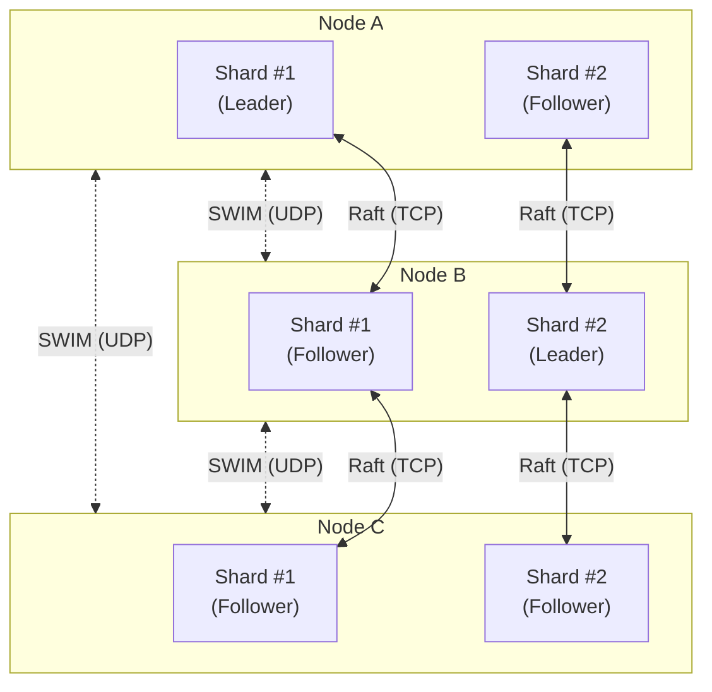
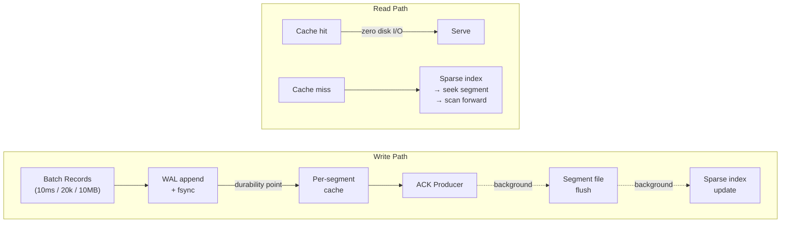
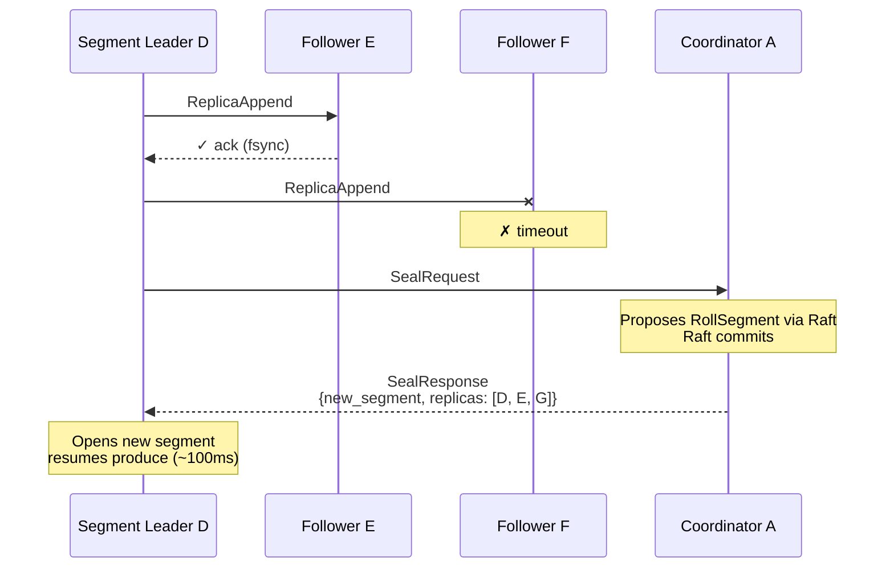

# EastGuard

**A zero-controller messaging system built for the scale that breaks Kafka.**

Kafka's architecture was revolutionary in 2011. But its monolithic controller, static partitions, and coarse-grained replication units create hard ceilings that no amount of tuning can fix. EastGuard removes those ceilings by separating concerns that Kafka entangles: metadata consensus, failure detection, data storage, and replication are independent subsystems that scale independently.

Inspired by LinkedIn's [Northguard](https://www.linkedin.com/blog/engineering/infrastructure/introducing-northguard-and-xinfra) architecture.

---

## Why EastGuard

### The Kafka Problem

Kafka routes all metadata through a single controller (or KRaft quorum). Every partition reassignment, every leader election, every ISR change funnels through one bottleneck. At hundreds of thousands of partitions, controller failover takes minutes. Rebalancing requires external tooling. A slow broker degrades the entire ISR, and operators must manually intervene.

### How EastGuard Fixes It

| | Kafka | EastGuard |
|---|---|---|
| **Metadata** | Single controller / KRaft quorum | Dynamically-sharded Raft groups (DS-RSM) -- metadata throughput scales linearly with brokers |
| **Partitioning** | Static partitions, manual reassignment | Dynamic ranges that split and merge automatically based on traffic load |
| **Replication unit** | Entire partition (can be hundreds of GB) | ~1 GB segments dispersed across the cluster -- automatic load balancing, no rebalancing tools |
| **Failure handling** | ISR shrink/expand + high watermark tracking | Seal the segment, open a new one with healthy replicas -- sealed data is immutable, recovery is just byte-copy |
| **Failure detection** | Heartbeat-based, centralized | SWIM protocol -- decentralized, O(log N) convergence, no heartbeat storm |
| **Consumer reads** | Leader-only (unless using follower fetching with lag) | Any replica -- every replica has all committed data |

---

## Metadata: Decentralized Control Plane

EastGuard replaces the monolithic controller with **DS-RSM** (Dynamically-Sharded Replicated State Machines). Metadata is sharded across many small Raft groups distributed over all brokers. Each shard group manages a subset of topics independently.



**How it works:**

- A consistent hash ring maps each topic to a shard group. The shard group's Raft leader is the **coordinator** for that topic -- it proposes all metadata changes (create topic, split range, seal segment) via Raft consensus.
- **SWIM protocol** handles failure detection and leader discovery. No central heartbeats. When a Raft election produces a new leader, SWIM gossips the change across the cluster in O(log N) rounds. Information flows one way: Raft decides leaders, SWIM tells everyone.
- **Adding a broker scales metadata.** More nodes = more shard groups = more metadata throughput. No single bottleneck to saturate.

**What the coordinator manages:**

| Operation | What Happens |
|---|---|
| `CreateTopic` | Creates topic + initial range (full keyspace) + initial segment |
| `SplitRange` | Seals parent range, creates two child ranges with new segments |
| `MergeRange` | Seals both source ranges, creates merged range with new segment |
| `RollSegment` | Seals current segment, creates new one with updated replica set |
| `DeleteTopic` | Cascades deletion through all ranges and segments |

All mutations are single Raft log entries -- atomic by construction. No two-phase commits. No cross-shard coordination for single-topic operations.

---

## Data Plane: Storage and Replication

Metadata nodes and data nodes are **independent**. The nodes running Raft consensus for a topic's metadata are not necessarily the nodes storing that topic's data.

### Storage Engine

Producer latency is bounded by a single sequential WAL fsync. Everything else happens in the background.



**Key design choices:**

- **Shared WAL per node.** One fsync per batch covers all segments in that batch. Amortizes the cost across hundreds of segments.
- **Per-segment actors.** Each segment owns its cache, checkpoint, and read path. No single-actor bottleneck.
- **Lock-free consumer reads.** Consumers read directly from per-segment cache without acquiring locks. Hot tail reads never touch disk.

### Replication: Seal-on-Failure

EastGuard uses primary-backup replication. Not Kafka ISR. Not BookKeeper quorum.

The producer connects to the segment leader. The leader replicates to **all** followers internally, waits for fsync ack from **all** replicas, then ACKs the producer. The producer sees one connection to one node -- no knowledge of replicas.

**When a replica fails, seal the segment and open a new one** with a healthy replica set:



**Why this beats ISR:**

- **Simpler invariant.** Active segment has all replicas healthy, or it gets sealed. No ISR set tracking, no shrink/expand protocol, no high watermark management.
- **Faster recovery.** Sealed segments are immutable. Replication is "read and copy bytes." No divergent state to reconcile.
- **Faster consumer reads.** Every replica has all committed data. Consumers read from the nearest replica. No watermark lag, no ISR tracking overhead.

### Dynamic Ranges

Unlike Kafka's static partitions, EastGuard ranges **split and merge automatically** based on traffic load. A topic starts with one range covering the full keyspace. As write throughput increases, hot ranges split. As traffic subsides, cold ranges merge back.

Each range produces ~1 GB segments that are individually placed across the cluster. This is **log striping** -- the physical storage units are small and independently movable, eliminating the resource skew that plagues Kafka's large partitions.

### Failure Detection

Two detection paths cover all failure modes:

| Path | Detects | Latency |
|---|---|---|
| **Write-path timeout** | Follower crash, disk failure, slow disk, network partition | Sub-second |
| **SWIM node death** | Leader crash, idle segment failures, node-level failures | ~6-7 seconds |

A slow replica is as bad as a dead replica. If one node's fsync takes 500ms instead of 10ms, every produce to that segment is blocked. Seal and move on.

---

## How To Start

```shell
cargo build
cargo run --bin server
```

### Running a 3-Node Cluster

```shell
# Terminal 1 (node-1):
cargo run --bin server -- \
  --client-port 3001 \
  --cluster-port 13001 \
  --advertise-host 127.0.0.1 \
  --data-dir /tmp/eg-node1 \
  --meta-dir /tmp/eg-node1-meta \
  --config-dir /tmp/eg-node1-config \
  --join-seed-nodes 127.0.0.1:13002 \
  --join-seed-nodes 127.0.0.1:13003 \
  --join-initial-delay-ms 500 \
  --join-interval-ms 500

# Terminal 2 (node-2):
cargo run --bin server -- \
  --client-port 3002 \
  --cluster-port 13002 \
  --advertise-host 127.0.0.1 \
  --data-dir /tmp/eg-node2 \
  --meta-dir /tmp/eg-node2-meta \
  --config-dir /tmp/eg-node2-config \
  --join-seed-nodes 127.0.0.1:13001 \
  --join-seed-nodes 127.0.0.1:13003 \
  --join-initial-delay-ms 500 \
  --join-interval-ms 500

# Terminal 3 (node-3):
cargo run --bin server -- \
  --client-port 3003 \
  --cluster-port 13003 \
  --advertise-host 127.0.0.1 \
  --data-dir /tmp/eg-node3 \
  --meta-dir /tmp/eg-node3-meta \
  --config-dir /tmp/eg-node3-config \
  --join-seed-nodes 127.0.0.1:13001 \
  --join-seed-nodes 127.0.0.1:13002 \
  --join-initial-delay-ms 500 \
  --join-interval-ms 500
```

---

## References

- [Northguard -- LinkedIn Engineering](https://www.linkedin.com/blog/engineering/infrastructure/introducing-northguard-and-xinfra)
- [SWIM: Scalable Weakly-consistent Infection-style Process Group Membership Protocol](https://www.cs.cornell.edu/projects/Quicksilver/public_pdfs/SWIM.pdf)

---

## Join the Community

[Discord](https://discord.gg/qJzSX6A6)
