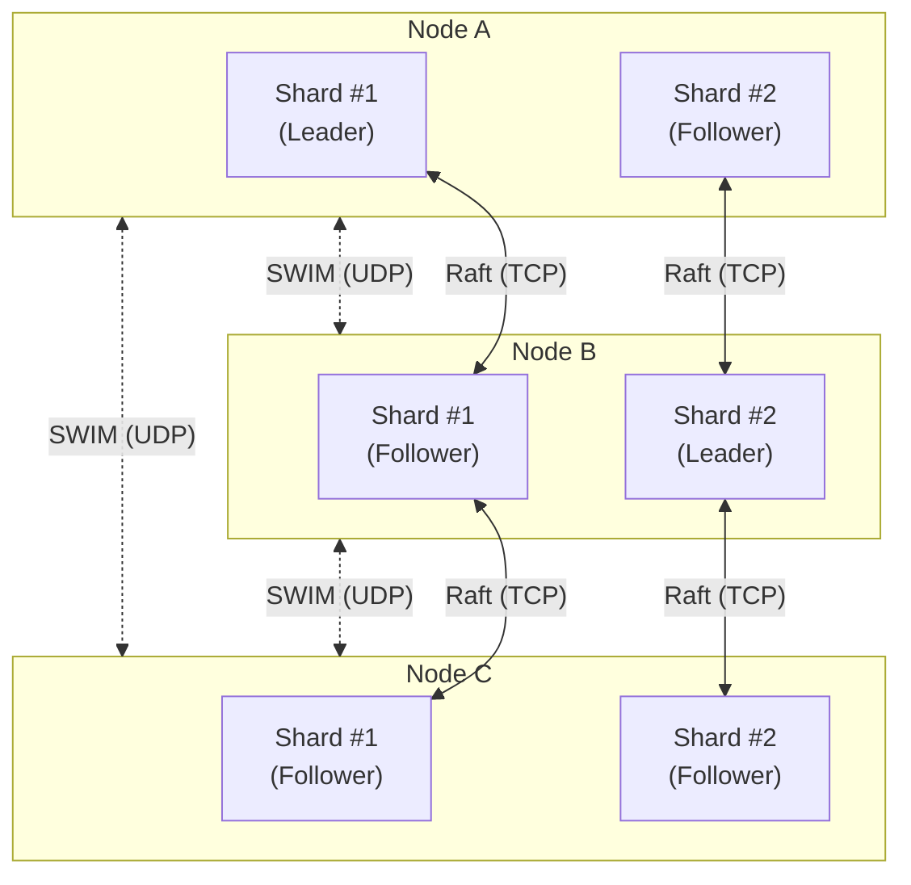
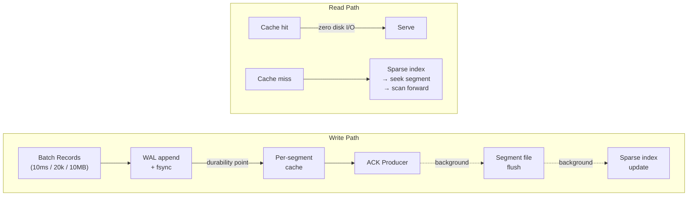
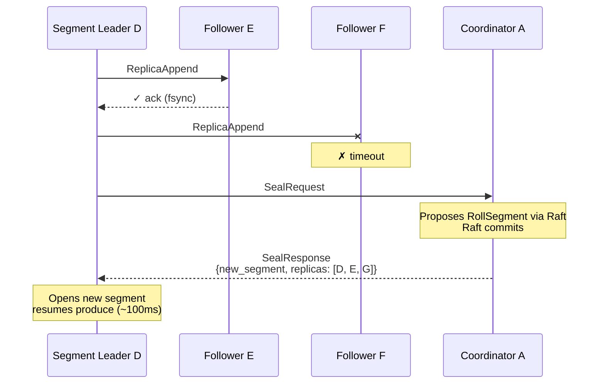
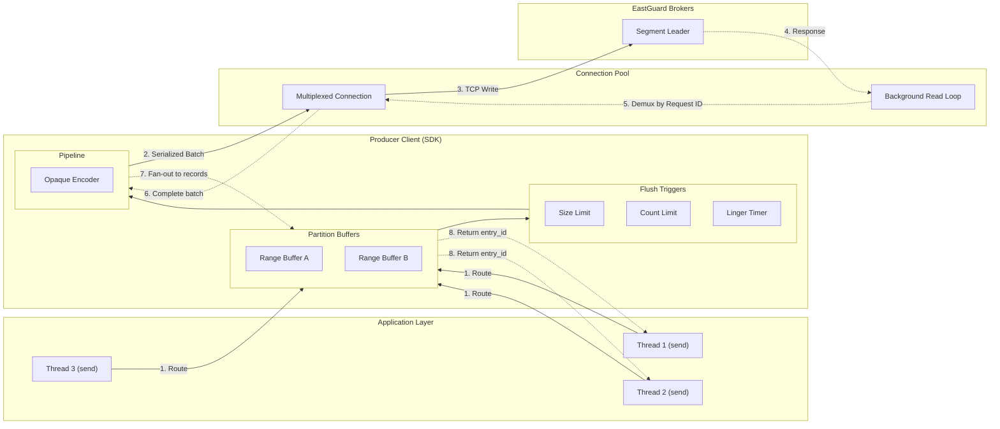

# EastGuard

**A zero-controller messaging system built for the scale that breaks Kafka.**

Kafka's architecture was revolutionary in 2011. But its monolithic controller, static partitions, and coarse-grained replication units create hard ceilings that no amount of tuning can fix. EastGuard removes those ceilings by separating concerns that Kafka entangles: metadata consensus, failure detection, data storage, and replication are independent subsystems that scale independently.

Inspired by LinkedIn's [Northguard](https://www.linkedin.com/blog/engineering/infrastructure/introducing-northguard-and-xinfra) architecture.

---

## Why EastGuard

### The Kafka Problem

Kafka routes all metadata through a single controller (or KRaft quorum). Every partition reassignment, every leader election, every ISR change funnels through one bottleneck. At hundreds of thousands of partitions, controller failover takes minutes. Rebalancing requires external tooling. A slow broker degrades the entire ISR, and operators must manually intervene.

### How EastGuard Fixes It

| | Kafka | EastGuard |
|---|---|---|
| **Metadata** | Single controller / KRaft quorum | Dynamically-sharded Raft groups (DS-RSM) -- metadata throughput scales linearly with brokers |
| **Partitioning** | Static partitions, manual reassignment | Dynamic ranges that split and merge automatically based on traffic load |
| **Replication unit** | Entire partition (can be hundreds of GB) | ~1 GB segments dispersed across the cluster -- automatic load balancing, no rebalancing tools |
| **Failure handling** | ISR shrink/expand + high watermark tracking | Seal the segment, open a new one with healthy replicas -- sealed data is immutable, recovery is just byte-copy |
| **Failure detection** | Heartbeat-based, centralized | SWIM protocol -- decentralized, O(log N) convergence, no heartbeat storm |
| **Consumer reads** | Leader-only (unless using follower fetching with lag) | Any replica -- every replica has all committed data |

---

## Metadata: Decentralized Control Plane

EastGuard replaces the monolithic controller with **DS-RSM** (Dynamically-Sharded Replicated State Machines). Metadata is sharded across many small Raft groups distributed over all brokers. Each shard group manages a subset of topics independently.



**How it works:**

- A consistent hash ring maps each topic to a shard group. The shard group's Raft leader is the **coordinator** for that topic -- it proposes all metadata changes (create topic, split range, seal segment) via Raft consensus.
- **SWIM protocol** handles failure detection and leader discovery. No central heartbeats. When a Raft election produces a new leader, SWIM gossips the change across the cluster in O(log N) rounds. Information flows one way: Raft decides leaders, SWIM tells everyone.
- **Adding a broker scales metadata.** More nodes = more shard groups = more metadata throughput. No single bottleneck to saturate.

**What the coordinator manages:**

| Operation | What Happens |
|---|---|
| `CreateTopic` | Creates topic + initial range (full keyspace) + initial segment |
| `SplitRange` | Seals parent range, creates two child ranges with new segments |
| `MergeRange` | Seals both source ranges, creates merged range with new segment |
| `RollSegment` | Seals current segment, creates new one with updated replica set |
| `DeleteTopic` | Cascades deletion through all ranges and segments |

All mutations are single Raft log entries -- atomic by construction. No two-phase commits. No cross-shard coordination for single-topic operations.

---

## Data Plane: Storage and Replication

Metadata nodes and data nodes are **independent**. The nodes running Raft consensus for a topic's metadata are not necessarily the nodes storing that topic's data.

### Storage Engine

Producer latency is bounded by a single sequential WAL fsync. Everything else happens in the background.



**Key design choices:**

- **Shared WAL per node.** One fsync per batch covers all segments in that batch. Amortizes the cost across hundreds of segments.
- **Per-segment actors.** Each segment owns its cache, checkpoint, and read path. No single-actor bottleneck.
- **Lock-free consumer reads.** Consumers read directly from per-segment cache without acquiring locks. Hot tail reads never touch disk.

### Replication: Seal-on-Failure

EastGuard uses primary-backup replication. Not Kafka ISR. Not BookKeeper quorum.

The producer connects to the segment leader. The leader replicates to **all** followers internally, waits for fsync ack from **all** replicas, then ACKs the producer. The producer sees one connection to one node -- no knowledge of replicas.

**When a replica fails, seal the segment and open a new one** with a healthy replica set:



**Why this beats ISR:**

- **Simpler invariant.** Active segment has all replicas healthy, or it gets sealed. No ISR set tracking, no shrink/expand protocol, no high watermark management.
- **Faster recovery.** Sealed segments are immutable. Replication is "read and copy bytes." No divergent state to reconcile.
- **Faster consumer reads.** Every replica has all committed data. Consumers read from the nearest replica. No watermark lag, no ISR tracking overhead.

### Dynamic Ranges

Unlike Kafka's static partitions, EastGuard ranges **split and merge automatically** based on traffic load. A topic starts with one range covering the full keyspace. As write throughput increases, hot ranges split. As traffic subsides, cold ranges merge back.

Each range produces ~1 GB segments that are individually placed across the cluster. This is **log striping** -- the physical storage units are small and independently movable, eliminating the resource skew that plagues Kafka's large partitions.

### Failure Detection

Two detection paths cover all failure modes:

| Path | Detects | Latency |
|---|---|---|
| **Write-path timeout** | Follower crash, disk failure, slow disk, network partition | Sub-second |
| **SWIM node death** | Leader crash, idle segment failures, node-level failures | ~6-7 seconds |

A slow replica is as bad as a dead replica. If one node's fsync takes 500ms instead of 10ms, every produce to that segment is blocked. Seal and move on.

---

## Client SDK

EastGuard includes a highly optimized client SDK designed for low-latency, high-throughput communication with the cluster. The SDK is split into a shared connection layer, a producer, and a consumer.

### Multiplexed Connection Core
The client manages a lazy connection pool that opens a single multiplexed TCP connection per EastGuard Broker. A background read loop listens on each connection and demultiplexes responses back to awaiting caller tasks using request IDs. This eliminates thread-of-execution bottlenecks and minimizes socket overhead.

### Producer: Thread-Safe Batching & Compression
The `Producer` is a thread-safe, cloneable client component designed to publish records to a specific topic with maximum throughput:

- **Partition-Level Concurrency**: Uses a sharded concurrent hash for range buffers. Threads writing to different range partitions acquire isolated entry locks, allowing parallel writes without contention.
- **End-to-End Compression**: Batched payloads are optionally compressed using block-level LZ4 or Zstd, prefixed with a 1-byte codec tag, and stored opaque on the server.
- **Idempotency Seam**: Stamps each buffered record with a globally unique `producer_id` and a monotonic sequence number to prepare for server-side deduplication.

#### High-Level Batching & Demultiplexing Architecture
The producer coordinates concurrent writes, partition-level buffering, batch triggers, and network multiplexing/demultiplexing through a highly parallel, asynchronous data flow:



Here is how the end-to-end write path operates:

1. **Routing & Thread-Safe Buffering**: Concurrent application threads produce data. The producer routes it to the target range's buffer. Buffers reduces lock contention by per-range shard operation.

2. **Dynamic Flush Triggers**: As records accumulate, three triggers monitor the buffer:
   - **Size Limit (`max_batch_bytes`)**: Triggers an immediate synchronous flush when the serialized byte limit is reached.
   - **Record Count Limit (`max_batch_records`)**: Triggers an immediate synchronous flush when the count limit is reached.
   - **Linger Timer (`linger`)**: When the first record of a batch is pushed, a lightweight one-shot timer is spawned to flush the buffer asynchronously after the configured duration.
3. **Pipeline & Network Write**: The thread that triggers the flush extracts the batch, serializes it, applies the configured compression codec (LZ4 or Zstd), and writes it as an opaque payload to the multiplexed TCP connection.
4. **Two-Stage Demultiplexing & Unblocking**: 
   - **Connection Demultiplexing**: When the broker sends the write acknowledgment, the client's background TCP read loop receives it and demultiplexes the response using its unique request ID, completing the batch-level future.
   - **Batch Demultiplexing (Fan-out)**: The completed batch future wakes up the producer's flushing thread, which demultiplexes (fans out) the single committed `entry_id` to the individual oneshot channels of all the threads (`T1`, `T2`, etc.) that contributed to that batch, unblocking them.

---

## Getting Started

### 1. Run a Local Cluster

EastGuard includes a convenient script to quickly boot a local 3-node cluster. The script automatically handles compiling the binaries and isolating the cluster data into a clean `.test_cluster` directory.

```shell
# Starts a clean 3-node cluster
bash run_cluster.sh

# Stops the running cluster
bash run_cluster.sh stop

# Cleans up all local cluster data
bash run_cluster.sh clean
```

### 2. Using the Interactive CLI

Once the cluster is running, you can interact with it using the built-in interactive CLI. The CLI is a powerful REPL (like `redis-cli`) that talks directly to the cluster using the EastGuard client SDK.

```shell
# Start the interactive CLI
cargo run --bin eg-cli
```

Inside the CLI prompt, you can run commands directly:

```text
eastguard> help
eastguard> create-topic my_topic 3
eastguard> publish my_topic user123 "Hello EastGuard!"
eastguard> consume my_topic earliest 10
```

### 3. Configuration

EastGuard supports a clean configuration hierarchy. The priority is (from highest to lowest):
1. **Command-Line Arguments** (e.g., `--client-port 3000`)
2. **Environment Variables** (e.g., `CLIENT_PORT=3000`)
3. **YAML Configuration File**
4. **Hardcoded Defaults**

To use a YAML configuration file, simply create an `eastguard.yaml` file in the directory where you run the server, or pass its path via `-c` or `--config`:

```yaml
# eastguard.yaml
client_port: 2921
cluster_port: 2922
data_port: 2923
host: "0.0.0.0"
advertise_host: "127.0.0.1"

vnodes_per_node: 256
join_seed_nodes:
  - "127.0.0.1:2922"
```

```shell
cargo run --bin server -- --config ./eastguard.yaml
```

---

## References

- [Northguard -- LinkedIn Engineering](https://www.linkedin.com/blog/engineering/infrastructure/introducing-northguard-and-xinfra)
- [SWIM: Scalable Weakly-consistent Infection-style Process Group Membership Protocol](https://www.cs.cornell.edu/projects/Quicksilver/public_pdfs/SWIM.pdf)

---

## Join the Community

[Discord](https://discord.gg/qJzSX6A6)
