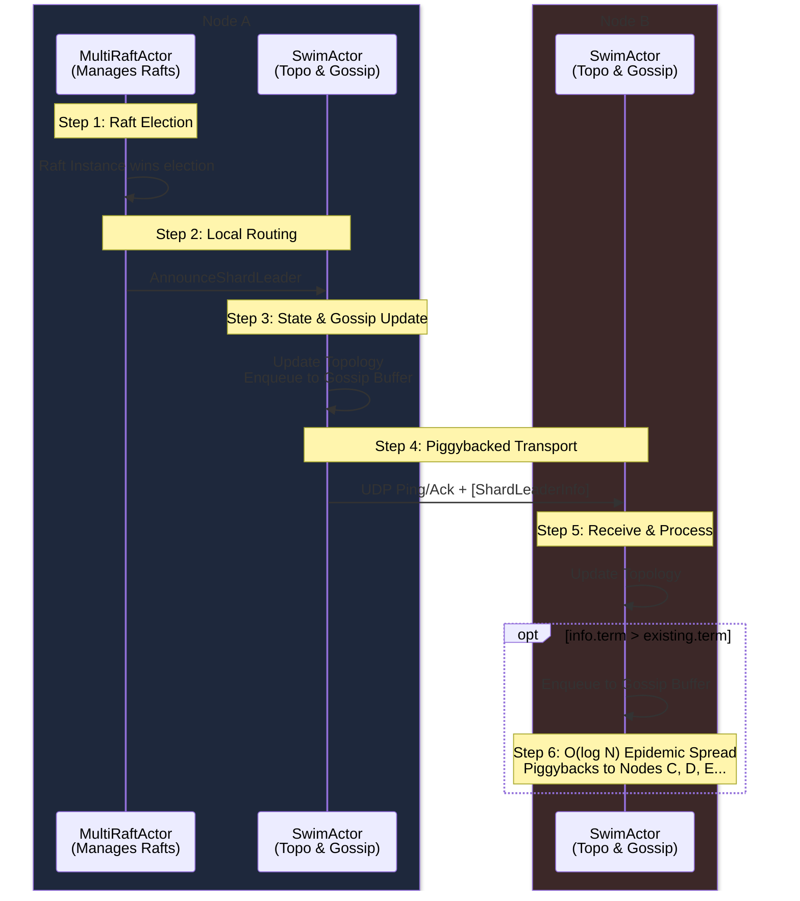
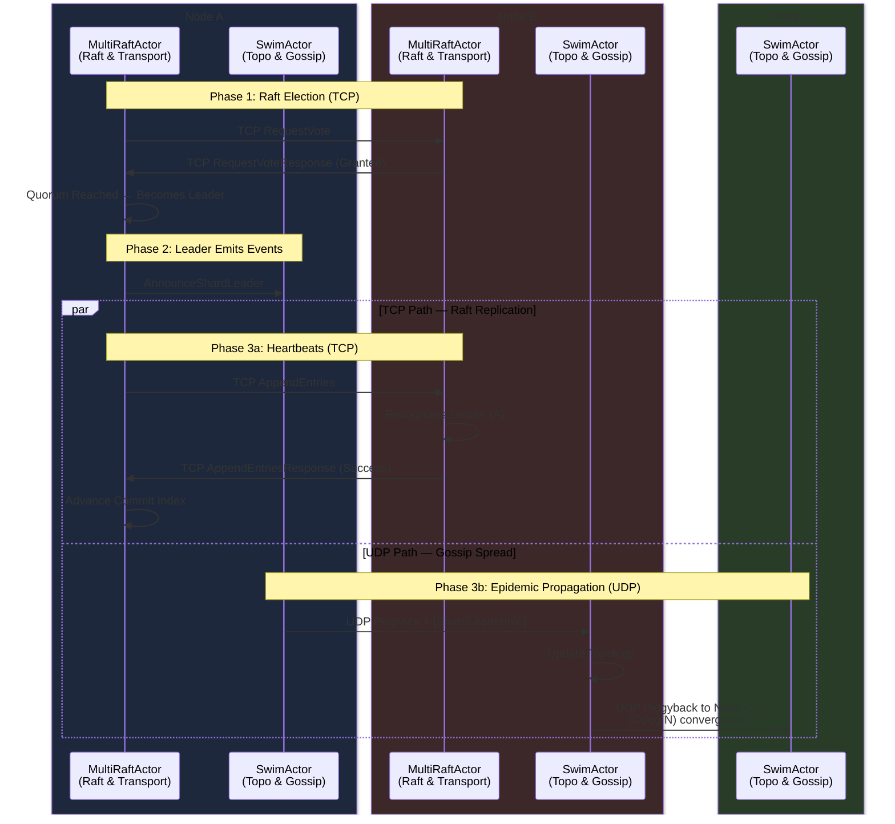

# EastGuard

EastGuard is a zero-controller messaging system designed for flexible scalability and high operability. This project is significantly inspired by the architecture of LinkedIn's Northguard.


## Terms

- **Control Plane:** A decentralized layer responsible for managing cluster metadata via DS-RSM. It stores topic configurations, range states (active/sealed), segment locations, etc.
- **Data Plane:** The layer responsible for storing actual application messages.
- **Consistent Hash Ring:** The topology used to map vNodes to physical brokers. It uses deterministic algorithms to calculate leaders and followers (Clockwise Walk) with constraint filtering (e.g., Rack Awareness).
- **vNode (Virtual Node):** A logical metadata shard acting as a local controller. It is a fault-tolerant replicated state machine backed by Raft that manages a specific subset of the cluster's metadata.
- **Coordinator:** The leader of a specific vNode. It executes business logic (e.g., splitting ranges, sealing segments) and replicates state changes to its followers.
- **SWIM (Scalable Weakly-consistent Infection-style Membership):** A decentralized protocol using Random Probing and Piggybacked Updates to detect failures and disseminate cluster state without the network saturation caused by central heartbeats.
- **Topic:** A named collection of ranges that covers the full keyspace.
- **Range:** The logical log abstraction (analogous to Kafka partitions). Unlike static partitions, ranges can dynamically split or merge with their buddy range to adapt to traffic load.
- **Segment:** The physical unit of replication (approx. 1 GB). These granular chunks naturally distribute across brokers, eliminating resource skew.

## How To Start 

```shell 
$ cargo build 

$ cargo run --bin server
```

### Running Cluster 

```shell 
# Terminal 1 (node-1):
cargo run --bin server -- \
--port 3001 \
--cluster-port 13001 \
--advertise-host 127.0.0.1 \
--data-dir /tmp/eg-node1 \
--config-dir /tmp/eg-node1-config \
--join-seed-nodes 127.0.0.1:13002 \
--join-seed-nodes 127.0.0.1:13003 \
--join-initial-delay-ms 500 \
--join-interval-ms 500

# Terminal 2 (node-2):
cargo run --bin server -- \
--port 3002 \
--cluster-port 13002 \
--advertise-host 127.0.0.1 \
--data-dir /tmp/eg-node2 \
--config-dir /tmp/eg-node2-config \
--join-seed-nodes 127.0.0.1:13001 \
--join-seed-nodes 127.0.0.1:13003 \
--join-initial-delay-ms 500 \
--join-interval-ms 500

# Terminal 3 (node-3):
cargo run --bin server -- \
--port 3003 \
--cluster-port 13003 \
--advertise-host 127.0.0.1 \
--data-dir /tmp/eg-node3 \
--config-dir /tmp/eg-node3-config \
--join-seed-nodes 127.0.0.1:13001 \
--join-seed-nodes 127.0.0.1:13002 \
--join-initial-delay-ms 500 \
--join-interval-ms 500
```


## Architecture

EastGuard eliminates the monolithic controller bottleneck found in systems (like Kafka) by separating the Control Plane and Data Plane.


- **Storage (Data Plane):** Implements Log Striping. Logical logs are broken into granular Segments dispersed across the cluster, ensuring automatic load balancing without external rebalancing tools.

### Metadata Management 
Managed via DS-RSM (Dynamically Sharded - Replicated State Machine). Metadata is sharded into vNodes and distributed across the cluster, allowing metadata throughput to scale linearly with the number of brokers.

#### Shard Leader Discovery using SWIM



#### Multi-Raft Transport 



## References

- [Northguard](https://www.linkedin.com/blog/engineering/infrastructure/introducing-northguard-and-xinfra)
- [SWIM](https://www.cs.cornell.edu/projects/Quicksilver/public_pdfs/SWIM.pdf)

